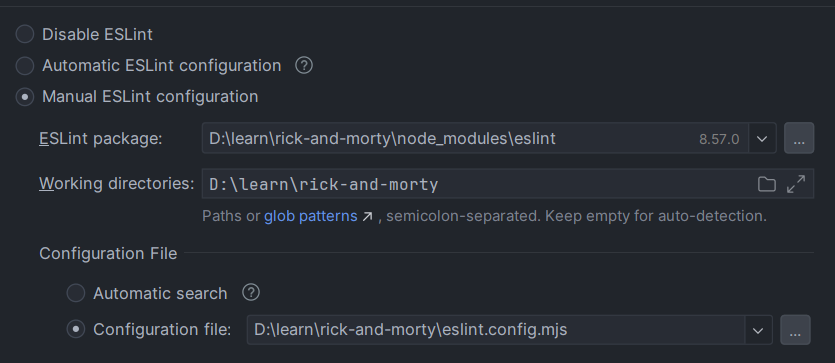

# Rick & Morty

Node Version - `18 or higher`

## IDE setup
Webstorm:
- set `.nuxt/gql` as `resource root` and `include` (for typescript hints) with graphql client
- eslint configuration:

VS Code:
- install `Vue - official`(Volar) plugin
- install `Nuxtr` plugin

## Setup

Make sure to install the dependencies:

```bash
# yarn
yarn install
```

## Development Server

Start the development server on `http://localhost:3000`:

```bash
# yarn
yarn dev
```

## Production

Build the application for production:

```bash
# yarn
yarn build
```
